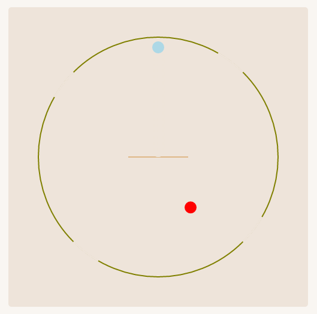

# Rebound

--A simple physical game

Control the baffle to change the ball's motion direction. You need to make the ball go outside and be careful not to touch the enemy.

It's an HTML game. <a href="https://enzeberg.github.io/rebound">Play it here!</a>

## Screenshot

## How to play
<h4>[for Desktop] </h4>

<strong>[for Mobile]</strong> Tap the <strong>center square area</strong> to rotate the baffle clockwise or anticlockwise.

<strong>[for Desktop]</strong> Press <strong>A or D key</strong> to rotate the baffle clockwise or anticlockwise.

